#### Make sure you have Git and Composer installed on your computer.

Open the terminal and navigate to the folder where you want to save this project.

Run this command to clone the repository:
```
git clone https://github.com/solarwind559/animal-farm.git
```
Navigate to the project directory:
```
cd animal-farm
```
And run commands:
```
composer install
npm install
```
Create a new empty database locally 

Duplicate the .env.example file in the root directory and rename it to .env

Find and edit this .env file section to match your local database details:
```
DB_CONNECTION=sqlite
DB_HOST=127.0.0.1
DB_PORT=3306
DB_DATABASE=laravel
DB_USERNAME=root
DB_PASSWORD=
```

Run commands:
```
php artisan key:generate
php artisan migrate
php artisan db:seed
npm run dev
php artisan serve
```


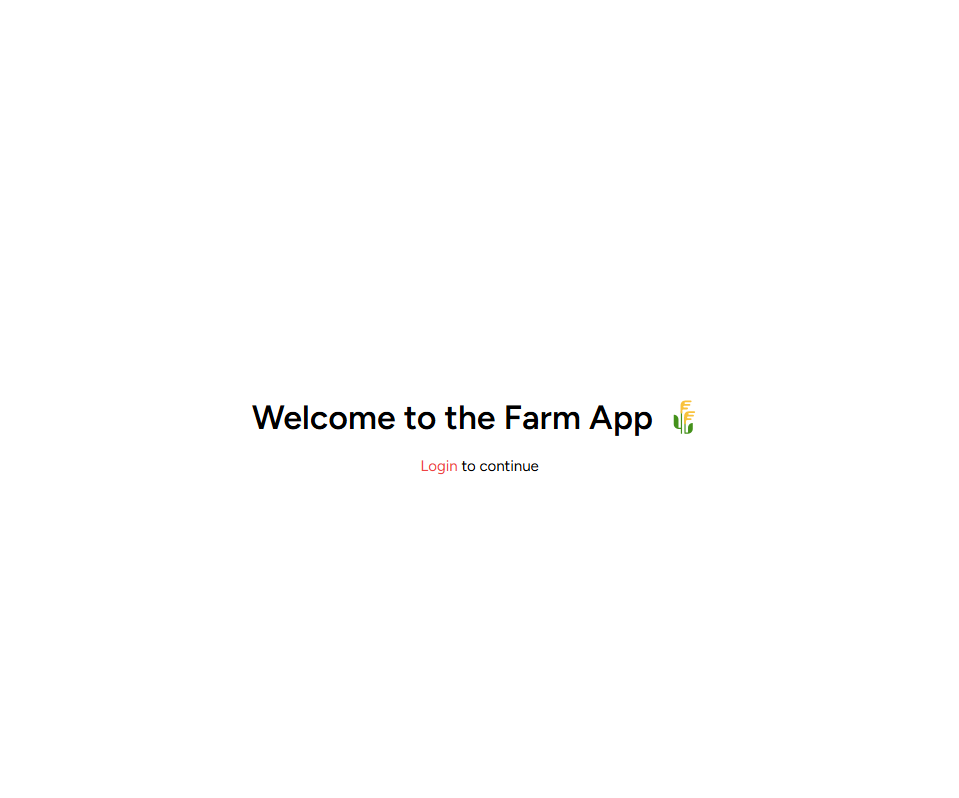 
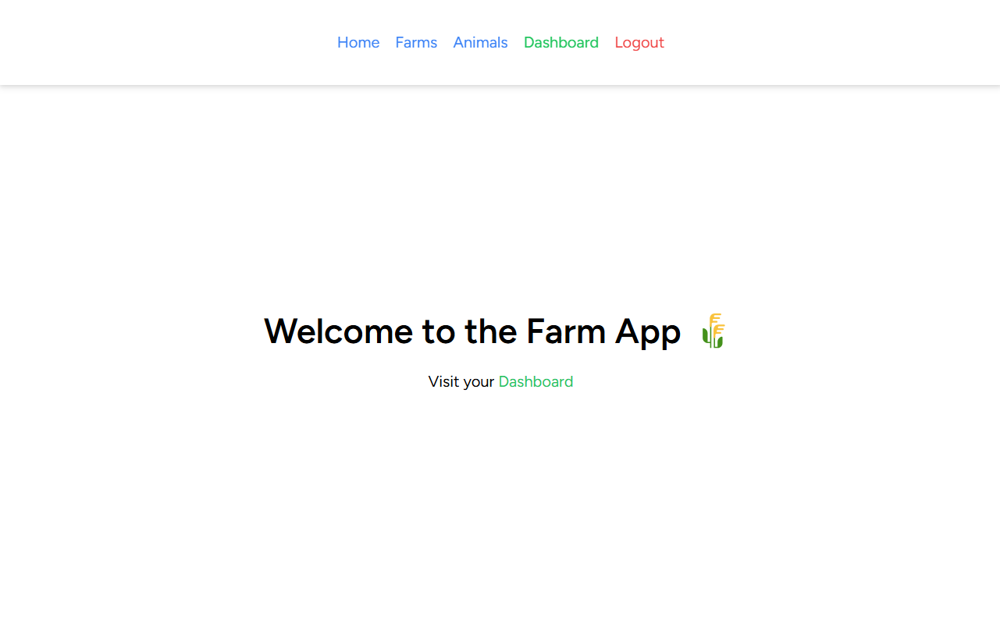 
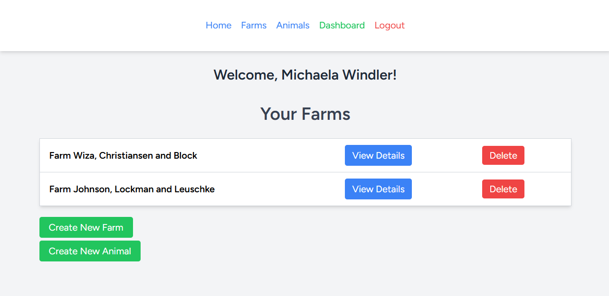 
 
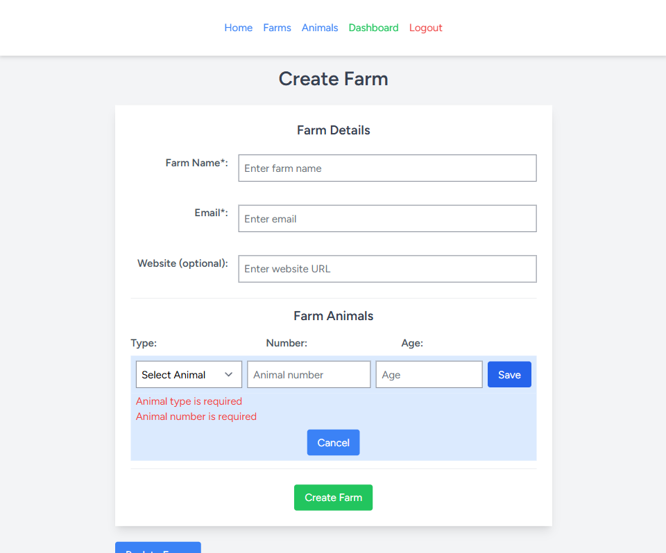 
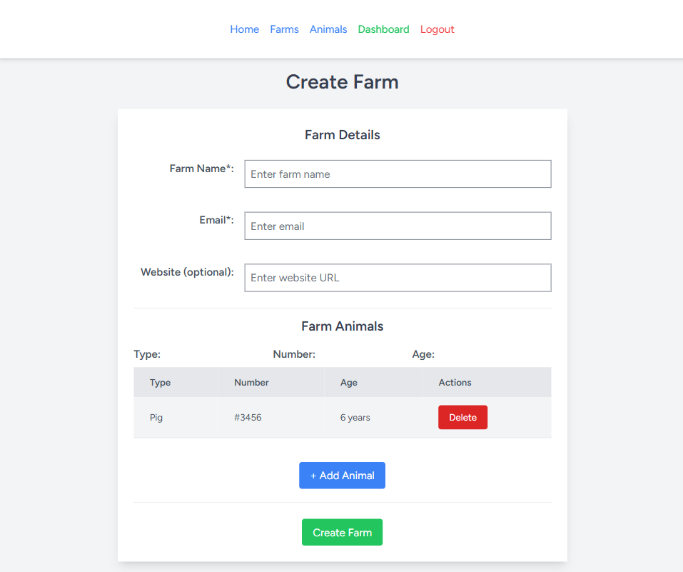 
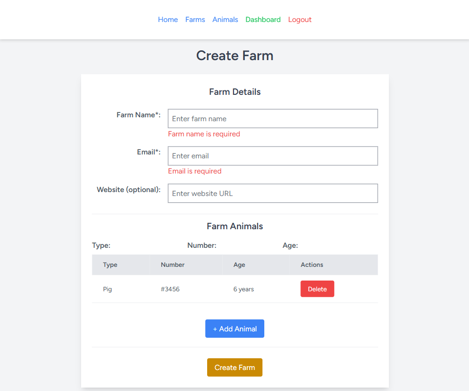 
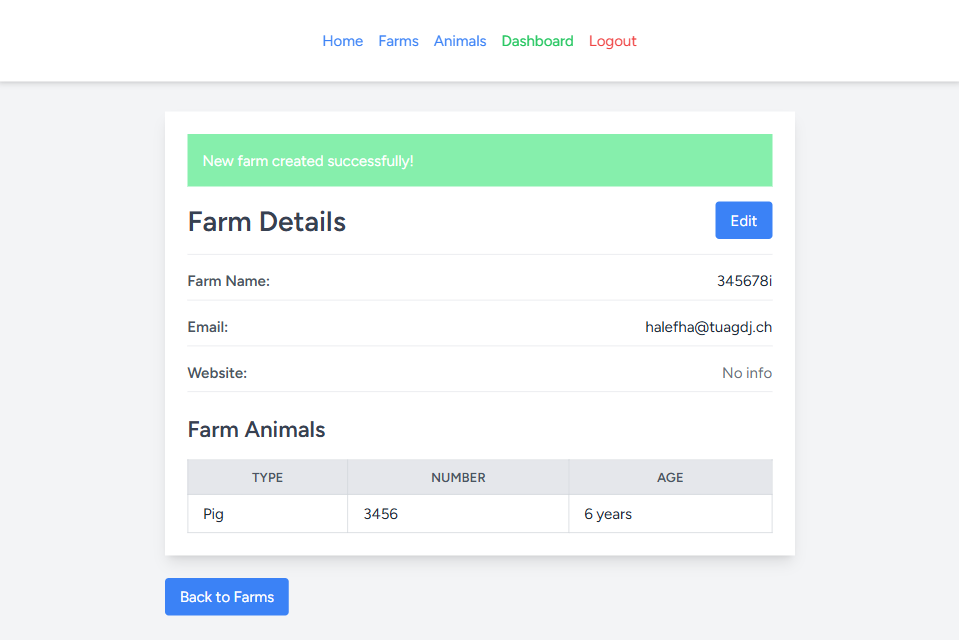 
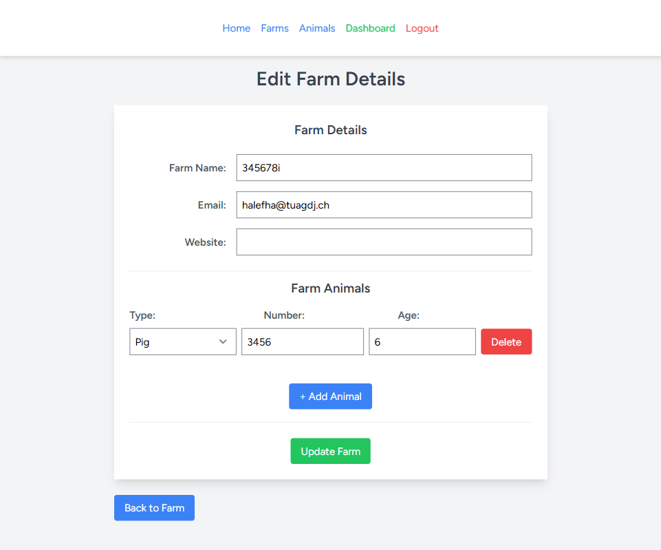 
 
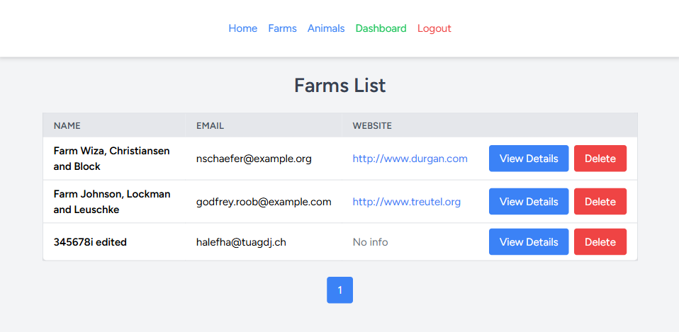 
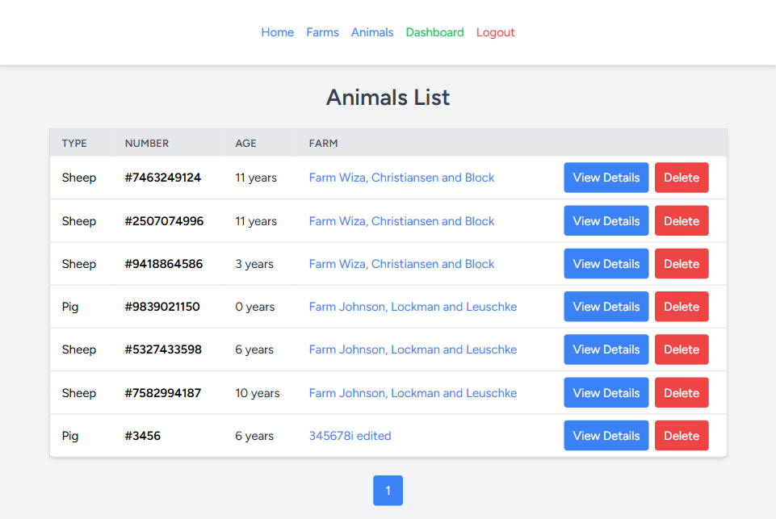 
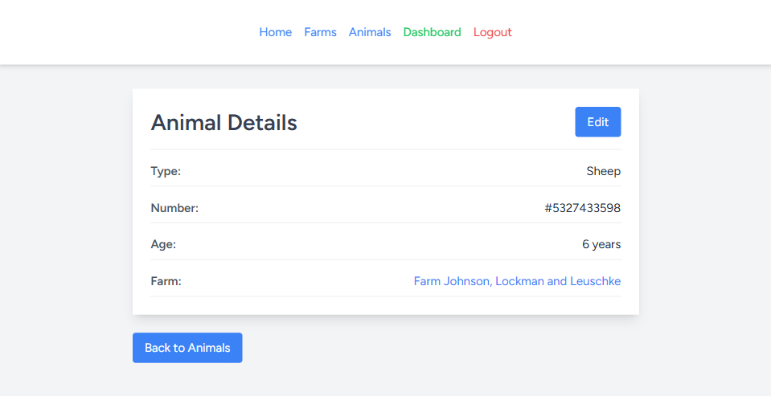 
 
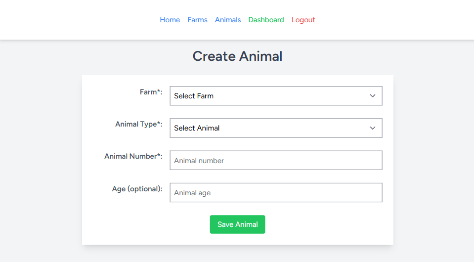 
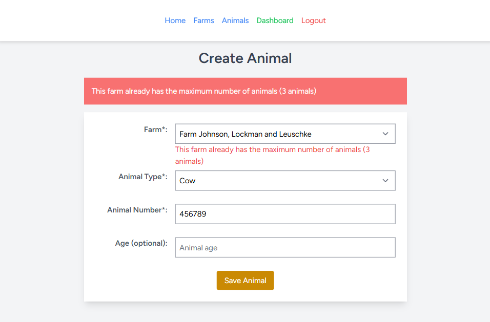 
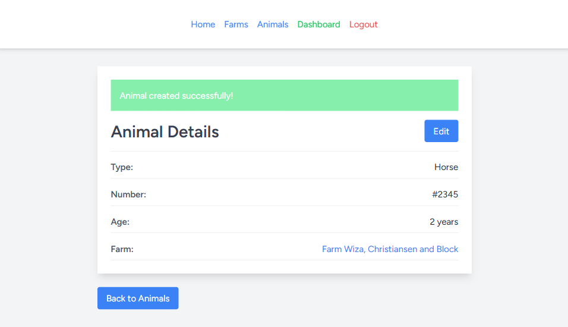


### Checklist:

* Using Laravel 12 and React create:
* Basic Auth: only logged in users are able to manage entities
* CRUD functionality for: Farms and Farm Animals. Each user can create Farms and add Animals to each Farm.
* Each user can access only their farms and animals data
* Farms table structure: Name (required), email, website (optional)
* Animals table structure: Animal Number (required), Type name (required), years (optional)
* Use migrations to create schemas
* Use database seeds to create two users who each has two farms with some animals in each farm
* Validate form data in both frontend and backend. Allow only 3 animals for each farm.
* Use pagination for showing Farms/Animals list, 10 entries per page
* Use resource controllers with default methods - index, create, store etc.
* Use tailwind
* Use TypescrYipt
* Use Docker to run project locally
* Use automated testing


farmedit ok
farmdetails ok
farmlist ok
farmcreate ok

animalcreate ok
animallist ok
animaledit ok
animadetails ok
