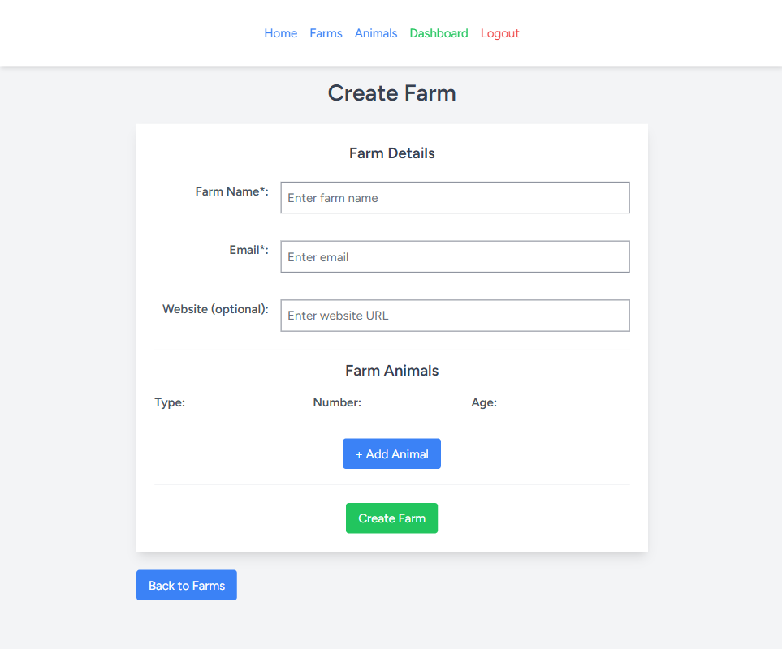
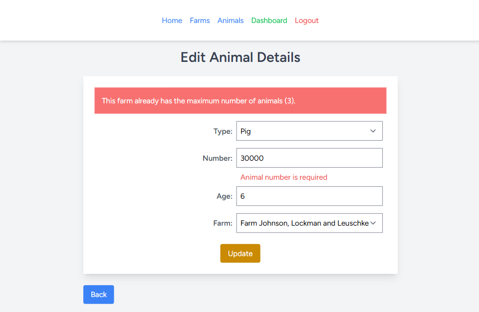

### Make sure you have Git, Composer and Docker Desktop installed on your computer.

Open the terminal and navigate to the folder where you want to save this project.

You can run it locally or on Docker.

## Run project locally

Run this command to clone the repository:
```
git clone https://github.com/solarwind559/animal-farm.git
```
Navigate to the project directory:
```
cd animal-farm
```
And run commands:
```
composer install
npm install
```
Create a new empty database locally 

Duplicate the .env.example file in the root directory and rename it to .env

Find and edit this .env file section to match your local database details:
```
DB_CONNECTION=mysql
DB_HOST=127.0.0.1
DB_PORT=3306
DB_DATABASE=laravel
DB_USERNAME=root
DB_PASSWORD=
```

Run commands:
```
php artisan key:generate
php artisan migrate
php artisan db:seed
npm run dev
php artisan serve
```
Follow the link to view the project in browser.

## Serve with Docker
Run this command to clone the repository:
```
git clone https://github.com/solarwind559/animal-farm.git
```
Navigate to the project directory:
```
cd animal-farm
```
Run Docker Desktop

Edit the Laravel app's .env file for the database to match the details inside the docker-compose.yaml file:
```
DB_CONNECTION=mysql
DB_HOST=db
DB_PORT=3306
DB_DATABASE=llkc_db
DB_USERNAME=llkc_user
DB_PASSWORD=llkc_password
```

Set the url from which you will access the app:

```
APP_URL=http://localhost:8000
```

Run:
```
docker-compose up -d --build
```
Inside the container, run:
```

docker exec -it laravel_app php artisan key:generate

docker exec -it laravel_app php artisan migrate

docker exec -it laravel_app php artisan db:seed

docker exec -it laravel_app npm install --save-dev vite

docker exec -it laravel_app npm run build

```
Access the app on browser:

http://localhost:8000/

### Access Database info for login details through MySQL
Run:
```
docker exec -it db mysql -u llkc_user -p
```
Use password: ```llkc_password```.

Inside MySQL, run:
```
USE llkc_db;
SELECT email, password FROM users;
```
#### You can now copy the (factory made) email addresses to authenticate through the /login page.

#### For all email addresses, use password = `password`

Login page: http://localhost:8000/login

## Screenshots

 
 
 
 
 
 
 
 
 
 
 
 
 
 
 
 


## Checklist:

* Using Laravel 12 and React create:
* Basic Auth: only logged in users are able to manage entities
* CRUD functionality for: Farms and Farm Animals. Each user can create Farms and add Animals to each Farm.
* Each user can access only their farms and animals data
* Farms table structure: Name (required), email, website (optional)
* Animals table structure: Animal Number (required), Type name (required), years (optional)
* Use migrations to create schemas
* Use database seeds to create two users who each has two farms with some animals in each farm
* Validate form data in both frontend and backend. Allow only 3 animals for each farm.
* Use pagination for showing Farms/Animals list, 10 entries per page
* Use resource controllers with default methods - index, create, store etc.
* Use tailwind
* Use TypescrYipt
* Use Docker to run project locally
* Use automated testing
